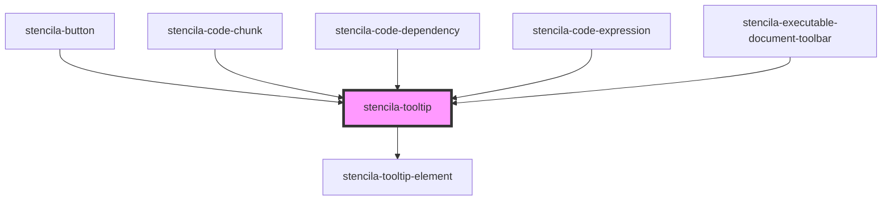

# stencila-tooltip

<!-- Auto Generated Below -->

## Properties

| Property            | Attribute  | Description                      | Type                                                                                                                                                                                                         | Default     |
| ------------------- | ---------- | -------------------------------- | ------------------------------------------------------------------------------------------------------------------------------------------------------------------------------------------------------------ | ----------- |
| `position`          | `position` | The placement of the tooltip     | `"auto" \| "auto-end" \| "auto-start" \| "bottom" \| "bottom-end" \| "bottom-start" \| "left" \| "left-end" \| "left-start" \| "right" \| "right-end" \| "right-start" \| "top" \| "top-end" \| "top-start"` | `'bottom'`  |
| `text` _(required)_ | `text`     | The text content of the Tooltip. | `string`                                                                                                                                                                                                     | `undefined` |

## Dependencies

### Used by

 - [stencila-button](../button)
 - [stencila-code-chunk](../codeChunk)
 - [stencila-code-dependency](../codeDependency)
 - [stencila-code-expression](../codeExpression)
 - [stencila-executable-document-toolbar](../executableDocumentToolbar)

### Depends on

- [stencila-tooltip-element](../tooltipElement)

### Graph

----------------------------------------------

*Built with [StencilJS](https://stenciljs.com/)*
