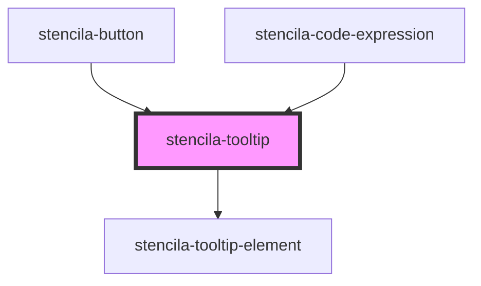

# stencila-tooltip

<!-- Auto Generated Below -->

## Properties

| Property            | Attribute | Description                      | Type     | Default     |
| ------------------- | --------- | -------------------------------- | -------- | ----------- |
| `text` _(required)_ | `text`    | The text content of the Tooltip. | `string` | `undefined` |

## Dependencies

### Used by

 - [stencila-button](../button)
 - [stencila-code-expression](../codeExpression)

### Depends on

- [stencila-tooltip-element](../tooltipElement)

### Graph

----------------------------------------------

*Built with [StencilJS](https://stenciljs.com/)*
